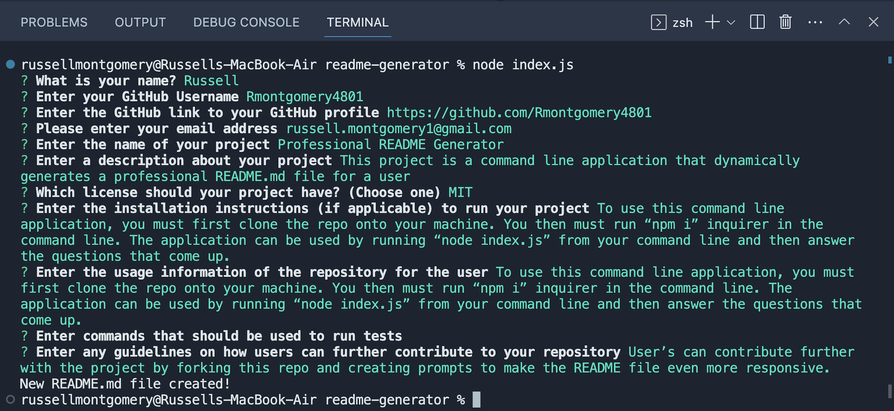
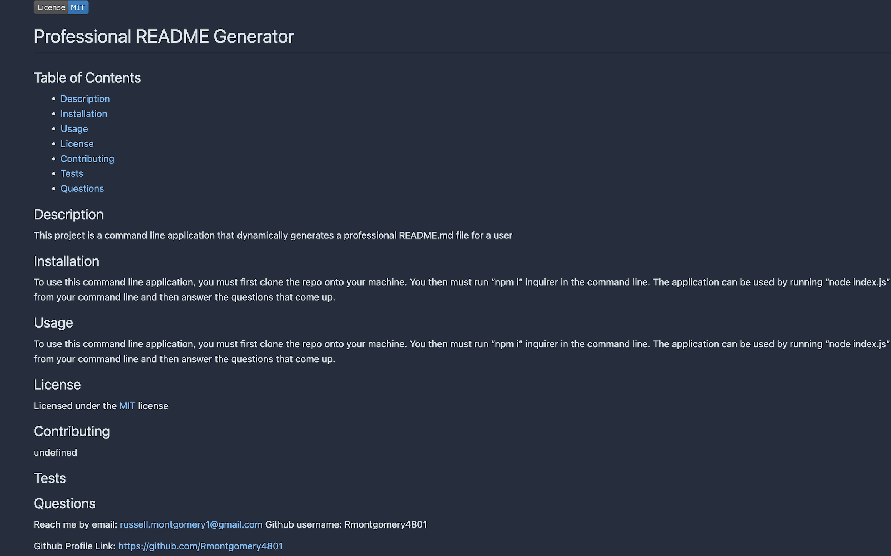

# README Generator

# Description

This application runs through the command line on your terminal and utilizes node.js to create a README file based on the data entered from the user.

# Installation & Usage
To run this application, the user must clone the repository onto machine. After cloning the user must instill Inquirer by running "npm i inquirer" in the command line. The application can be ran by using "node index.js" from the command line and answering the questions that appear. Once information is collected a README will be generated.

# Video Demonstration
https://youtu.be/PmoDgkRoR_8